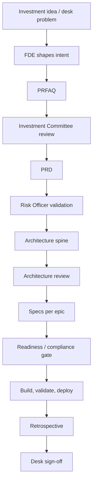

# AI-Driven Agile for Asset Management & Hedge Funds

## What This Guide Covers

BMad works well in finance when the process matches the risk of the work. This guide shows how to move from an investment thesis or desk problem to a deployed tool without losing auditability, compliance, or speed.

Use it when the work touches portfolio decisions, risk data, trade support, compliance automation, or anything that needs a clear decision trail.

## Why Finance Needs a Different Delivery Loop

- The customer is usually a portfolio manager, trader, risk analyst, or compliance lead.
- The work often has regulatory and operational consequences.
- The team needs fast iteration, but the final system must be reproducible and reviewable.
- Requirements usually begin as investment intent, not as a written product brief.

BMad makes those implicit decisions explicit at the right time and keeps each decision in a named artifact.

## The Fintech Delivery Loop

1. Shape the investment idea or desk problem with the FDE.
2. Write the PRFAQ when the idea needs committee review.
3. Get Investment Committee approval.
4. Draft the PRD as the investment thesis in product form.
5. Validate the PRD with the Risk Officer.
6. Capture architecture decisions in a spine.
7. Review the architecture with Engineering and Risk.
8. Write one spec per epic.
9. Clear the readiness and compliance gate.
10. Build, test, validate, and deploy.
11. Run the retrospective and get desk sign-off.

## The Five Approval Gates

| Gate | Purpose | Typical Artifact |
| --- | --- | --- |
| Investment Committee review | Confirms the idea is worth funding and aligns with the mandate | PRFAQ |
| Risk Officer validation | Checks model risk, data provenance, controls, and exposure | PRD |
| Architecture review | Confirms the design is safe to build and can support parallel work | Architecture spine |
| Readiness / compliance gate | Confirms controls, audit trail, and operational readiness | Specs and release checklist |
| Post-deployment retrospective | Confirms the desk can use the system and the outcome matches intent | Retrospective |

## When To Start Where

- Use `bmad-forge-idea` when the desk problem is still vague.
- Use `bmad-prfaq` when you need committee approval.
- Use `bmad-prd` when the thesis is clear and needs governance.
- Use `bmad-architecture` when the system will be built by more than one person or team.
- Use `bmad-spec` when the work is ready to split into buildable epics.
- Use `bmad-retrospective` when the feature is live and needs desk validation.

## Related Fintech Guides

- [Roles and Workflows](./roles-and-workflows.md)
- [Forward Deployed Engineer](./fde-role.md)
- [Investment Thesis to Deployed Tool](../fintech/investment-thesis-to-deployed-tool.md)
- [Risk Dashboard Development Process](../fintech/risk-dashboard-development-process.md)
- [Compliance System Implementation](../fintech/compliance-system-implementation.md)
- [FDE Role Definition](../fintech/fde-role-definition.md)
