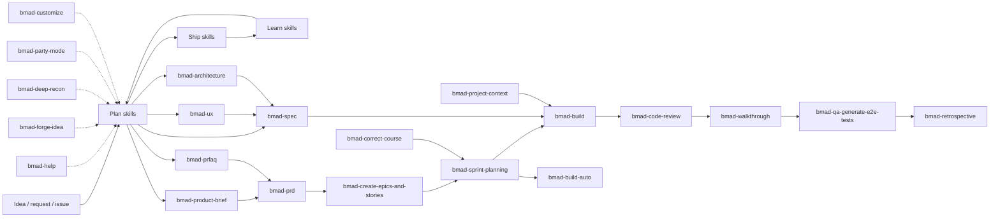
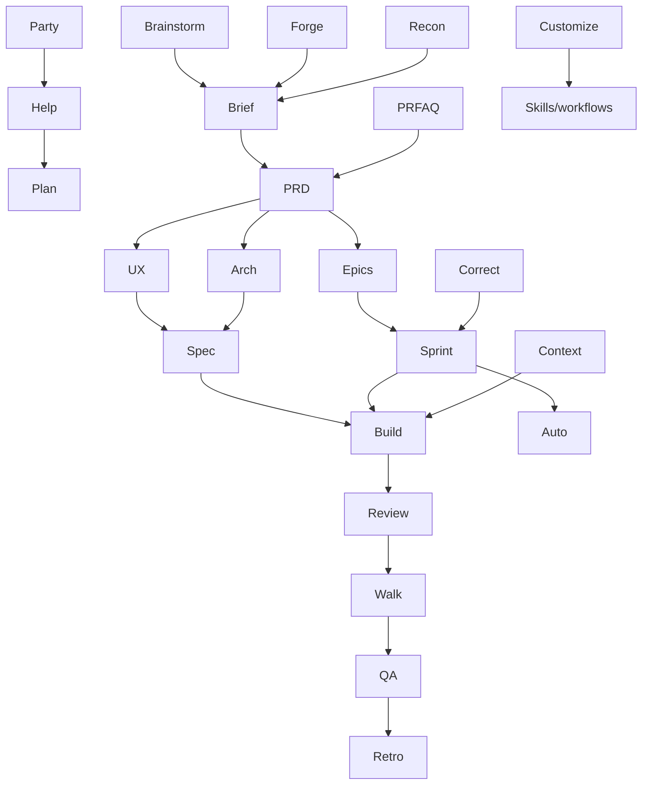

Use this page to understand how BMAD skills fit together, how they hand work off, and how to design or extend them without breaking the delivery loop.

## Architecture at a Glance

## Skill Anatomy

Every BMAD skill follows the same basic shape:

1. Frontmatter with `name`, `description`, and optional metadata.
2. Narrative instructions that define purpose and constraints.
3. Conventions for path resolution, config lookup, and workflow fields.
4. An activation sequence that resolves config and loads persistent context.
5. One or more intent branches that produce artifacts, ask questions, or dispatch other skills.

### Common fields

| Field | Meaning |
| --- | --- |
| `name` | Canonical skill id. |
| `description` | Short routing summary used by installers and catalogs. |
| `metadata.lifecycle` | Marks deprecated shims and forwarding behavior. |
| `workflow.*` | Resolved per-skill configuration merged from `customize.toml`. |

### Common lifecycle

| Stage | What happens |
| --- | --- |
| Resolve | Load config, persistent facts, and skill-local customization. |
| Route | Detect intent and choose the narrowest applicable branch. |
| Execute | Produce artifacts, call subskills, or run reviews/tests. |
| Finalize | Write outputs, update status, and hand off to the next step. |

## Agent Specialization Roles

| Agent | Role | Main surface |
| --- | --- | --- |
| Analyst (Mary) | Discovery, research, brief formation, context | Plan, research, project context |
| Product Manager (John) | Product scope, PRDs, epics, readiness | Plan and sprint readiness |
| Architect (Winston) | Cross-system decisions and implementation alignment | Architecture and readiness |
| Developer (Amelia) | Implementation, review, testing, retrospectives | Ship and learn |
| UX Designer (Sally) | Product experience and UI behavior | UX planning |

## Skill Catalog

### Core BMAD skills

| Skill | Phase | Inputs | Outputs | Invokes / depends on |
| --- | --- | --- | --- | --- |
| `bmad-help` | anytime | Question, repo state, artifacts | Ranked next steps | Reads catalog and project artifacts |
| `bmad-advanced-elicitation` | anytime | Recent output | Refined output | Often called by planning and review skills |
| `bmad-review` | anytime | Diff, file, doc, branch | Triaged findings | Base review engine for shims and retrospectives |
| `bmad-customize` | anytime | Desired override | TOML override | Writes skill/workflow customization |
| `bmad-brainstorming` | plan | Idea or topic | `brainstorm.html`, optional intent | Feeds brief and spec workflows |
| `bmad-deep-recon` | plan | Research decision | `research.md`, report artifacts | Feeds brief, PRD, spec, and architecture |
| `bmad-forge-idea` | plan | Half-formed idea | `forge-report.html`, optional `forged-idea.md` | Feeds product planning |
| `bmad-party-mode` | anytime | Topic, party config | Live multi-agent discussion | Supports planning, review, and custom parties |

### Planning and definition skills

| Skill | Phase | Inputs | Outputs | Invokes / depends on |
| --- | --- | --- | --- | --- |
| `bmad-product-brief` | plan | Idea, context | `brief.md`, `addendum.md` | Can hand off to PRD/spec |
| `bmad-prfaq` | plan | Product concept | PRFAQ, summary | Feeds PRD or spec |
| `bmad-prd` | plan | Brief, PRFAQ, intent | `prd.md`, `addendum.md` or validation | Feeds UX, architecture, epics, spec |
| `bmad-spec` | plan | Intent, PRD, UX, architecture | `SPEC.md`, support files | Feeds Build directly |
| `bmad-ux` | plan | UX goals, product context | `DESIGN.md`, `EXPERIENCE.md` | Feeds spec and stories |
| `bmad-architecture` | plan | System scope, spec, codebase | Architecture spine | Feeds spec, stories, project context |

### Planning-to-shipping bridge

| Skill | Phase | Inputs | Outputs | Invokes / depends on |
| --- | --- | --- | --- | --- |
| `bmad-create-epics-and-stories` | plan | PRD, architecture | Epics and stories | Feeds sprint planning |
| `bmad-sprint-planning` | plan | PRD, UX, architecture, epics | Readiness verdict, `sprint-status.yaml` | Gate before Build / Auto |
| `bmad-correct-course` | plan | Changed requirements or architecture | Change proposal | Re-runs planning and sprinting |
| `bmad-project-context` | anytime | Repo, installed module context | `AGENTS.md` or audit output | Supports later Build and team alignment |

### Shipping and learning skills

| Skill | Phase | Inputs | Outputs | Invokes / depends on |
| --- | --- | --- | --- | --- |
| `bmad-build` | ship | Request, issue, spec, story | Code, commit, implementation record | Uses review and may hand off to walkthrough or tests |
| `bmad-build-auto` | ship | Intent, spec, story | Code, status, implementation record | Autonomous worker for one unit |
| `bmad-code-review` | ship | Diff, PR, branch, file | Findings and triage | Uses `bmad-review` style review layers |
| `bmad-walkthrough` | ship | Finished change | Guided manual review | Often follows Build |
| `bmad-qa-generate-e2e-tests` | learn | Implemented code | API/E2E tests | Follows Build or walkthrough |
| `bmad-retrospective` | learn | Epic evidence | Retro, verdict, action items | Uses review findings and epic evidence |

## Relationship Graph

## Skill YAML and Manifest Patterns

BMAD skill files are markdown with YAML frontmatter. The current patterns are:

| Pattern | Purpose |
| --- | --- |
| `name` + `description` | Canonical identity and routing summary. |
| `metadata.lifecycle: shim` | Deprecated skill that forwards to a replacement. |
| Body instructions | Human-readable workflow contract. |
| `customize.toml` | Per-skill override surface for behavior and prompts. |
| `bmad-skill-manifest.yaml` | File-level manifest for installer mapping. |

### Manifest behavior

| Rule | Meaning |
| --- | --- |
| Single-entry manifest | Applies one canonical id to every file in the directory. |
| Multi-entry manifest | Keys entries by source filename. |
| Canonical ids | Define BMAD-owned installed skills regardless of prefix. |
| Shim ids | Preserve old names while forwarding to current skills. |

## Best Practices for Skill Design

1. Keep each skill focused on one decision boundary or one unit of work.
2. Make inputs explicit and outputs durable.
3. Route early, then branch narrowly.
4. Use shims for compatibility, not for new behavior.
5. Put cross-skill coordination in shared artifacts, not hidden state.
6. Prefer one output contract per skill.
7. Let planning skills produce artifacts Build can read directly.
8. Use review skills to triage, not to generate noise.
9. Reserve autonomous loops for stable scope and well-formed inputs.
10. Keep customization sparse and scoped.

## Deprecated and Forwarding Skills

Deprecated skills still matter because they define routing compatibility and relationship inheritance.

| Deprecated skill | Current target | Effect |
| --- | --- | --- |
| `bmad-create-prd` | `bmad-prd` | PRD forwarder |
| `bmad-edit-prd` | `bmad-prd` | PRD forwarder |
| `bmad-market-research` | `bmad-deep-recon` | Research forwarder |
| `bmad-generate-project-context` | `bmad-project-context` | Context forwarder |
| `bmad-checkpoint-preview` | `bmad-walkthrough` | Walkthrough forwarder |
| `bmad-review-adversarial-general` | `bmad-review` | Adversarial lens shim |
| `bmad-review-edge-case-hunter` | `bmad-review` | Edge-case lens shim |
| `bmad-review-verification-gap` | `bmad-review` | Verification-gap lens shim |
| `bmad-editorial-review` | `bmad-review` | Structure + prose shim |
| `bmad-editorial-review-structure` | `bmad-review` | Structure shim |
| `bmad-editorial-review-prose` | `bmad-review` | Prose shim |

## Delivery Loop Summary

- **Plan** shapes the contract.
- **Ship** turns the contract into code and verifies it.
- **Learn** tests the result against reality and feeds the next plan.

The loop is not linear at the skill level. `bmad-help`, `bmad-party-mode`, `bmad-advanced-elicitation`, and `bmad-customize` can appear anywhere to improve the current decision.
